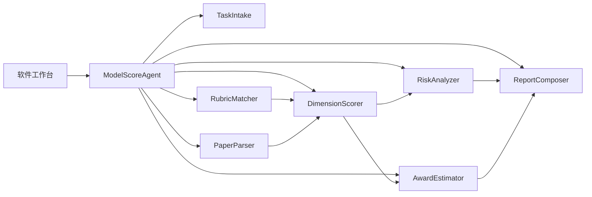
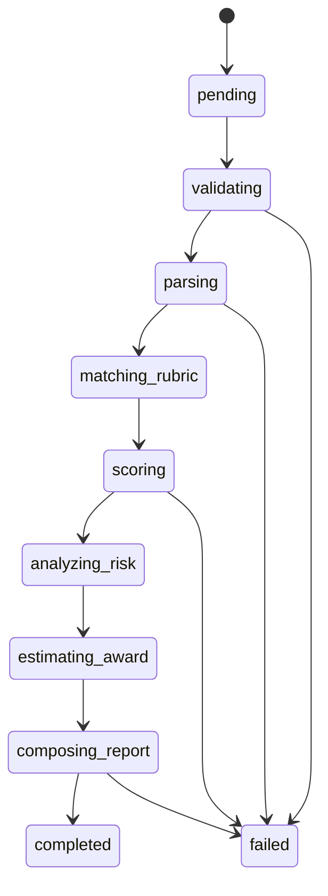

# 模评云评分智能体设计 v0.1

## 智能体名称

- 英文：`ModelScoreAgent`
- 中文：模评云评分智能体
- 定位：面向数学建模论文的可解释评审智能体

## 设计目标

`ModelScoreAgent` 的职责是把一次论文评审任务从“材料输入”推进到“结构化评分报告”。它不负责代写论文，也不直接修改用户论文，只输出评分、依据、风险、修订建议和估奖解释。

v0.1 先采用本地规则和模拟数据完成闭环；后续把论文理解、模型评价、结果合理性判断和建议生成接入大模型或专业评分服务。

## 核心功用

### 1. 比赛期间：论文初稿诊断

用户在比赛期间上传论文初稿、代码和数据附件后，智能体调用大模型和规则引擎分析：

- 模型假设是否合理
- 模型结构是否贴合题意
- 求解过程是否完整
- 结果是否合理、正确、可解释
- 代码是否能支撑论文中的结果
- 摘要、图表、结论和附录是否需要修改

输出重点是“怎么改”，包括高优先级修改建议、可能影响冲奖的短板、补充实验建议和格式风险。

### 2. 比赛结束后：估奖与检测报告

用户在比赛结束后上传最终论文和代码后，智能体根据不同比赛的侧重点、评价标准、往年获奖作品特点和当前作品风险项，输出：

- 奖项概率分布
- 估奖理由
- 关键加分项
- 关键扣分项
- 与往年获奖作品特征的相似点和差距
- 可导出的检测报告

估奖报告必须使用对应比赛的真实奖项体系，而不是统一使用“特等奖、一等奖、二等奖、三等奖”。例如美赛使用 `O/F/S/M`，国赛使用 `国赛一等奖、国赛二等奖、赛区一等奖、赛区二等奖`。其他赛事也必须按赛事规则和时间阶段配置奖项标签，例如一等、二等、三等、优秀奖或成功参赛奖。如果比赛奖项和地区有关，智能体需要在创建任务时要求用户选择赛区。

输出重点是“为什么可能是这个奖项”，报告必须解释概率依据，而不是只给一个分数。

## 能力边界

### 负责

1. 接收评审任务：竞赛、题号、队伍编号、评审模式、文件清单。
2. 匹配规则：根据竞赛类型加载评分维度、格式规范和权重。
3. 分析材料：提取论文结构、摘要、公式、图表、参考文献、代码附件状态，并读取用户上传的其他参照文件。
4. 诊断模型与结果：评估模型合理性、结果正确性和代码支撑程度。
5. 生成评分：输出总分、六维分、扣分项和置信度。
6. 生成建议：按优先级输出可执行修改建议。
7. 估计奖项：输出特等奖、一等奖、二等奖、三等奖概率。
8. 解释估奖：说明奖项概率来自哪些规则、历史特征和作品短板。
9. 生成报告：返回可导出为 JSON、PDF、Word 的结构化数据。

### 不负责

1. 不生成可直接提交的完整论文。
2. 不承诺真实比赛获奖结果。
3. 不绕过匿名评审、查重或赛事规则。
4. 不把用户论文默认上传到外部服务；外部模型调用必须显式配置。

## 总体架构



## 子模块设计

### 1. TaskIntake

校验任务输入，生成标准化 `ReviewTask`。

关键校验：

- 竞赛类型不能为空。
- 题号必须属于竞赛允许范围。
- 队伍编号保留原始值，但报告中默认脱敏。
- 文件类型仅允许 PDF、DOCX、ZIP 或后续明确支持的格式。

### 2. PaperParser

把论文和附件解析为 `ParsedPaper`。

v0.1 可先返回模拟解析结果；v0.2 开始接入真实 PDF/DOCX 文本提取。

输出重点：

- 章节完整性
- 摘要与关键词
- 公式数量和编号情况
- 图表数量和引用情况
- 参考文献格式
- 代码和数据附件状态

### 3. RubricMatcher

根据竞赛、题号和评审模式加载评分规则。

规则来源：

- 通用六维评分规则
- 竞赛专属格式规范
- 题目类型偏好，例如优化、预测、评价、仿真
- 用户自定义权重

### 4. DimensionScorer

对六个核心维度生成分数和扣分依据。

固定维度：

1. 假设合理性
2. 建模创新性
3. 结果正确性
4. 表述清晰性
5. 代码可复现性
6. 图文美观性

每个维度必须返回：

- `score`：0 到 100
- `confidence`：0 到 1
- `evidence`：评分依据
- `deductions`：扣分项

### 5. ModelReasoner

调用大模型或本地规则，对论文中的模型设计和结果进行深度判断。

比赛期间重点：

- 模型假设是否过强或缺失
- 目标函数和约束是否对应题意
- 结果数值是否存在明显异常
- 是否需要补充敏感性分析、误差分析或对比实验

赛后估奖重点：

- 模型复杂度是否符合该赛事偏好
- 结果呈现是否接近获奖论文风格
- 创新点是否足够明显
- 关键短板是否会压低奖项等级

### 6. RiskAnalyzer

将维度扣分项转成可执行风险列表。

风险优先级：

- `high`：影响冲奖或可能导致明显失分
- `medium`：影响可读性、复现性或论证完整性
- `low`：格式、表达或展示细节

### 7. AwardEstimator

根据总分、维度短板、竞赛类型和风险项估算奖项概率。

v0.1 可使用启发式计算；后续可结合往年获奖作品特征、赛事评分偏好和历史数据拟合。

输出必须包含：

- 特等奖概率
- 一等奖概率
- 二等奖概率
- 三等奖概率
- 未获奖/低奖项风险提示
- 估奖解释

### 8. ReportComposer

将评分结果整理为 `ReviewReport`。

报告要求：

- 可被前端直接渲染。
- 可导出 JSON。
- 字段结构稳定，便于后续导出 PDF/Word。
- 所有建议必须有对应证据或规则来源。

## 状态流转



状态含义：

- `pending`：任务已创建，等待运行
- `validating`：校验输入
- `parsing`：解析论文和附件
- `matching_rubric`：匹配规则
- `scoring`：计算维度分
- `analyzing_risk`：生成风险项
- `estimating_award`：估算奖项概率
- `composing_report`：组装报告
- `completed`：完成
- `failed`：失败并返回可读错误

## 评分原则

1. 可解释优先：每个分数都必须能追溯到证据或规则。
2. 保守估计：证据不足时降低置信度，不虚构不存在的论文内容。
3. 建议可执行：避免“加强论证”这类空泛建议，必须说明改哪里、为什么、优先级。
4. 规则可替换：不同竞赛的规则权重必须可以独立配置。
5. 隐私默认本地：文件解析和报告生成默认在本地或私有后端完成。

## v0.1 实现策略

第一阶段只实现同步本地智能体：

```text
createReviewTask(input)
runReview(task)
return ReviewReport
```

内部可先复用 `app.js` 现有六维分、建议和奖项概率逻辑，但需要迁移到独立模块，避免 UI 脚本承担评分职责。

## 后续演进

1. v0.1：本地规则智能体，跑通工作台。
2. v0.2：接入 PDF/DOCX 真实解析。
3. v0.3：加入大模型评审器，但保留规则引擎兜底。
4. v0.4：支持批量评审和任务历史。
5. v1.0：桌面端与后端评分服务联调。
